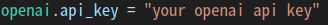
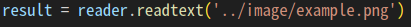
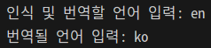
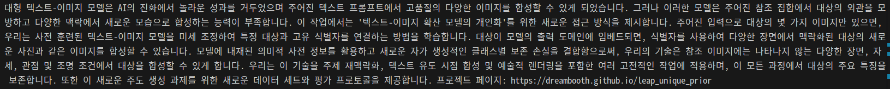
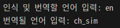
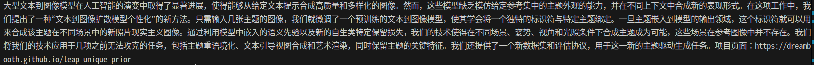

# OCR with ChatGPT automation(Translate)

### 1. OpenAI API Key 입력

### 2. 코드 실행 및 언어 입력

#### OCR 인식 이미지 경로

#### example 1
- english -> korean

- 결과 1

#### example 2
- english -> chinese

- 결과 2

